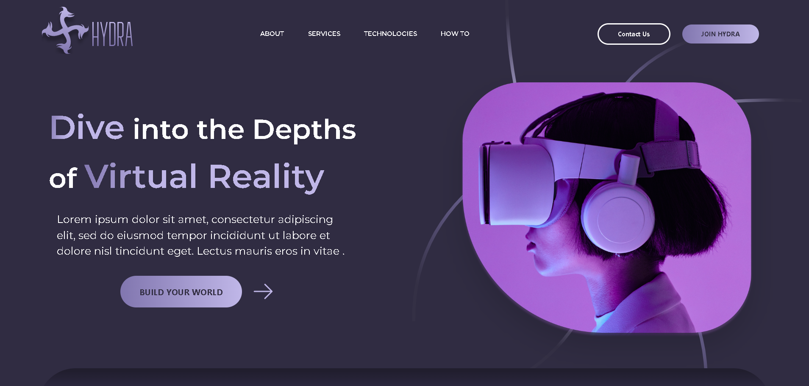

# HYDRA VR V1.0 🥽



---
Based on the design by [Zine E. Falouti](https://www.figma.com/community/file/1196146735025729739) , HYDRA VR is a sleek, modern and responsive website built using the latest frontend technologies. This was built with reusablity in mind. The content can the edited to whatever you need and the job is made fairly simple, even for someone with little-to-no tech background.

---

## Built with 🔧

Listed below  are the technologies utilized in building HYDRA-VR.

* React 
* Material Tailwind
* Vite
## Getting started  🖥️

To get started, you need `NodeJS`  and `git` to be installed locally in your computer. 

To check if node and git are installed on your computer, run the following commands on your terminal.

```
$ node --version
```
```
$ git --version
```
This should return a version  number if they are installed. If not you can download them here.

- [`git`](https://git-scm.com/downloads)

- [`NodeJS`](https://nodejs.org/en)


Once downloaded, clone or download the project and open it in your code editor and run the following commands.

```
$ npm install
```
```
$ npm run dev
```

This should download all the dependencies and run the app in development mode.

You can view it on your browser through [http://localhost:5173](http://localhost:5173)

If you're having a hard time figuring things out, [click here](https://www.youtube.com/watch?v=tv8iK7cAT8E) for a quick walkthrough on how to clone the git repository and install dependencies.

---

## How to make changes 🖊️

The vast majority of the text displayed can be edited through `constants.js` which can the accessed through `src/constants/constants.js`

All you have to do is edit the code here.


Below is a preview of `constants.js` file.
``` js
 export const cards =[{
    id: "simulation",
    heading: "SIMULATION",
    description: "Vitae sapien pellentesque habitant morbi nunc. Viverra aliquet porttitor rhoncus libero justo laoreet sit amet vitae.",
    button: "TRY IT NOW",
    image: uses01
  },
  {
    id: "education",
    heading: "EDUCATION",
    description: "Vitae sapien pellentesque habitant morbi nunc. Viverra aliquet porttitor rhoncus libero justo laoreet sit amet vitae.",
    button: "TRY IT NOW",
    url: "https://youtu.be/dQw4w9WgXcQ",
    image: uses03
  },
  {
    id: "self-care",
    heading: "SELF-CARE",
    description: "Vitae sapien pellentesque habitant morbi nunc. Viverra aliquet porttitor rhoncus libero justo laoreet sit amet vitae.",
    button: "TRY IT NOW",
    url: "https://youtu.be/dQw4w9WgXcQ",
    image: uses04
  },
  {
    id: "outdoor",
    heading: "OUTDOOR",
    description: "Vitae sapien pellentesque habitant morbi nunc. Viverra aliquet porttitor rhoncus libero justo laoreet sit amet vitae.",
    url: "https://youtu.be/dQw4w9WgXcQ",
    button: "TRY IT NOW",
    image: uses02
  }
]
```
To change images navigate to `src/assets`

If you don't want to hassle yourself with going thorugh the code to edit the images, replace them with   new images renamed with that of the previous.

Ofcourse, if you know how to navigate your way around code, the changes you could make are endless. Have fun XD

---

## Deploy 🌐

Run the following command and upload the dist folder that gets generated to your hosting site of preferrence

```
$ npm run build
```

## Contributions 🤝

Contributions are what make the open source community such an amazing place to learn, inspire, and create. Any contributions you make are greatly appreciated.

If you have a suggestion that would make this better, please fork the repo and create a pull request. You can also simply open an issue with the tag "enhancement". Don't forget to give the project a star! Thanks again!

---

## License 🪪

Distributed under the MIT License. See LICENSE.txt for more information.

---

## Acknowledgments

The following are a list of resources that were helpful in building HYDRA-VR

- [Zine E. Falouti - UI Design](https://www.figma.com/community/file/1196146735025729739)

- [Figma](https://www.figma.com/)

- [Material Tailwind ](https://www.material-tailwind.com/)


